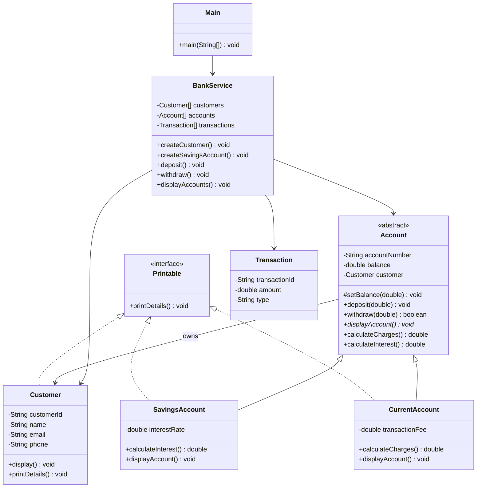

# Banking UML

```mermaid
classDiagram
    class Printable {
        <<interface>>
        +printDetails() void
    }
    class Customer {
        -String customerId
        -String name
        -String email
        -String phone
        +display() void
        +printDetails() void
    }
    class Account {
        <<abstract>>
        -String accountNumber
        -double balance
        -Customer customer
        #setBalance(double) void
        +deposit(double) void
        +withdraw(double) boolean
        +displayAccount()* void
        +calculateCharges() double
        +calculateInterest() double
    }
    class SavingsAccount {
        -double interestRate
        +calculateInterest() double
        +displayAccount() void
    }
    class CurrentAccount {
        -double transactionFee
        +calculateCharges() double
        +displayAccount() void
    }
    class Transaction {
        -String transactionId
        -double amount
        -String type
    }
    class BankService {
        -Customer[] customers
        -Account[] accounts
        -Transaction[] transactions
        +createCustomer() void
        +createSavingsAccount() void
        +deposit() void
        +withdraw() void
        +displayAccounts() void
    }
    class Main {
        +main(String[]) void
    }

    Printable <|.. Customer
    Printable <|.. SavingsAccount
    Printable <|.. CurrentAccount
    Account <|-- SavingsAccount
    Account <|-- CurrentAccount
    Account --> Customer : owns
    BankService --> Customer
    BankService --> Account
    BankService --> Transaction
    Main --> BankService
```